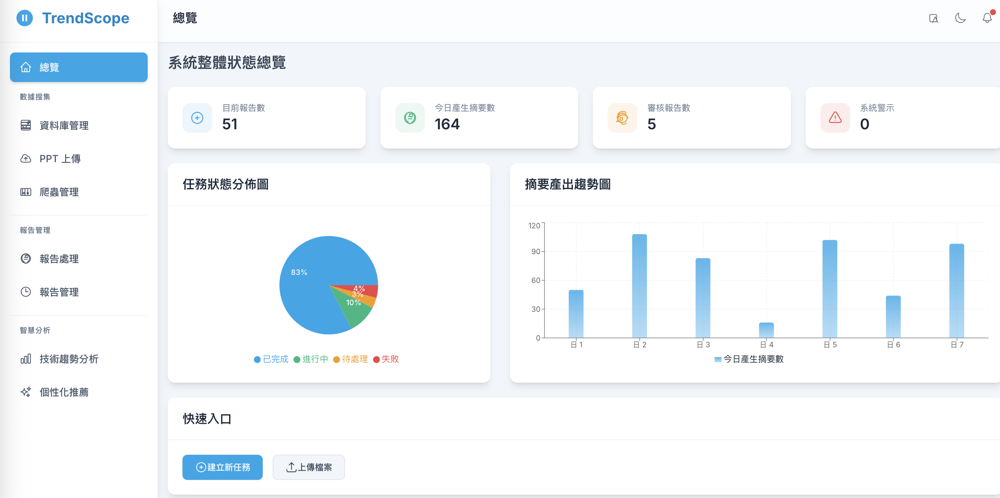
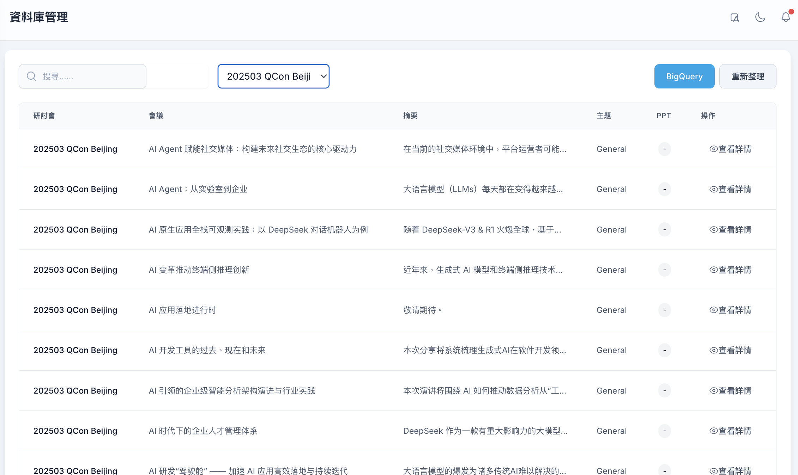
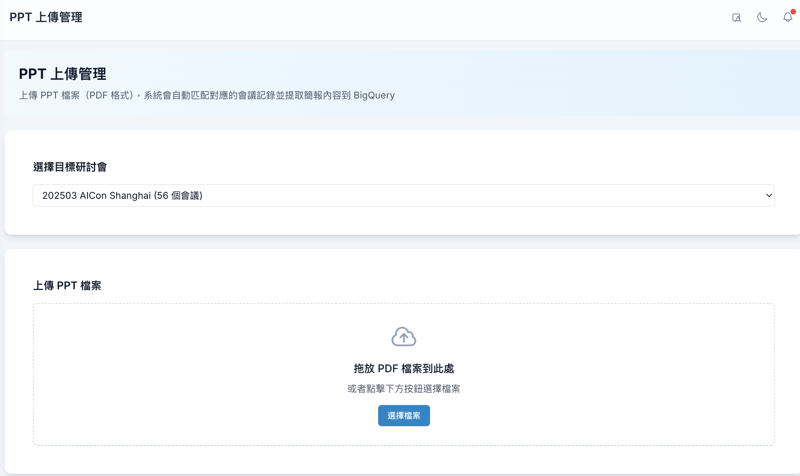
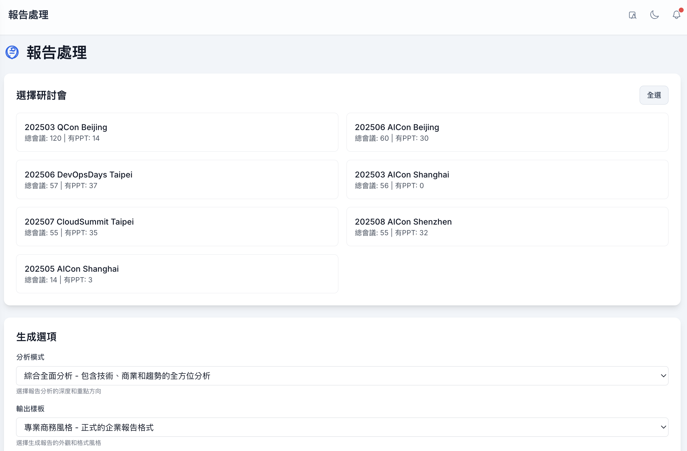
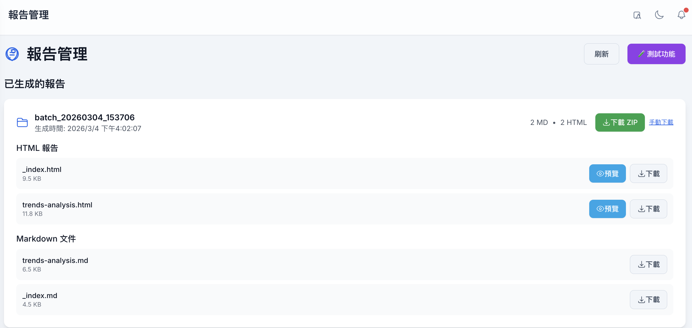
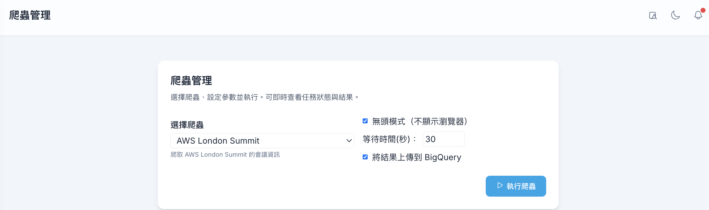

# TrendScope 

一個全面的會議內容處理與報告生成平台，使用 AI 技術自動處理、摘要並生成結構化報告。本專案結合了自動化逐字稿處理、網頁爬蟲、資料管理和報告生成功能。

## 🎯 專案概述

TrendScope 是一個自動化工具，能夠處理會議逐字稿、簡報檔案和網頁爬取的內容，生成結構化報告。包含：

- **AI 驅動的摘要生成**：使用 Google Gemini API 生成結構化摘要
- **網頁爬蟲**：自動化爬取各種會議網站
- **資料管理**：BigQuery 整合，用於儲存和查詢會議資料
- **報告生成**：自動生成 HTML/Markdown 報告
- **RESTful API**：基於 FastAPI 的後端，供前端整合使用

## ✨ 核心功能

### 主要功能
- **批次處理**：處理大量會議逐字稿和簡報檔案
- **AI 摘要生成**：使用 Gemini API 自動生成結構化摘要
- **主題分類**：按技術主題組織內容
- **多線程處理**：高效的並行處理支援
- **錯誤處理**：完整的錯誤處理與重試機制

### API 與後端
- **RESTful API**：基於 FastAPI 的後端，提供完整的端點
- **爬蟲管理**：管理爬蟲的 API 端點
- **PPT/PDF 處理**：上傳並處理簡報檔案
- **BigQuery 整合**：查詢和管理會議資料
- **批次報告生成**：從 BigQuery 資料生成報告

### 基礎架構
- **統一配置管理**：使用 Pydantic 集中管理設定
- **結構化日誌**：完整的日誌系統
- **錯誤處理**：全局異常處理器，統一的錯誤響應格式
- **CORS 支援**：可依環境配置的 CORS 設定

## 📁 專案結構

```
TrendScope/
├── base/                    # 後端 API 和核心模組
│   ├── api/                # FastAPI 應用程式
│   │   ├── routes/         # API 路由處理器
│   │   ├── modules/       # 業務邏輯模組
│   │   └── middleware/    # 中間件（錯誤處理器等）
│   ├── bigquery/          # BigQuery 客戶端和結構定義
│   ├── scrapers/          # 網頁爬蟲模組
│   │   ├── parsers/       # 網站特定解析器
│   │   └── utils/         # 爬蟲工具
│   ├── gcs/               # Google Cloud Storage 客戶端
│   └── utils/             # 共用工具（日誌等）
├── config/                # 配置管理
│   ├── settings.py        # 集中化設定（Pydantic）
│   └── config.py          # 向後相容層
├── scripts/               # 處理腳本
│   ├── 01_batch_summarize_process.py
│   ├── 02_category_page.py
│   └── ...
├── src/                   # 舊版核心模組
├── frontend/              # React 前端應用程式
├── data/                  # 輸入資料目錄
├── output/                # 生成的報告
├── logs/                  # 應用程式日誌
└── pyproject.toml         # 專案套件配置
```

## 🖼️ 介面總覽（UI Overview）

以下截圖展示 TrendScope 從資料導入到報告瀏覽的完整流程：

- **首頁儀表板**：整體入口與導覽。
  
- **BigQuery 資料與設定**：管理研討會資料來源與查詢。
  
- **PPT / PDF 上傳**：上傳簡報檔案，交由 AI 進行處理。
  
- **批次報告生成頁面**：設定批次報告參數並啟動 AI 生成流程。
  
- **生成的 Markdown / HTML 報告**：瀏覽與檢視分析結果。
  
- **爬蟲管理頁面**：管理並執行會議來源的網頁爬蟲。
  

## 🚀 快速開始

### 前置需求

- Python 3.10+
- Node.js 16+（前端需要）
- Google Cloud 帳戶（BigQuery 和 Gemini API）

### 安裝步驟

1. **克隆專案**
   ```bash
   git clone <repository-url>
   cd TrendScope
   ```

2. **安裝為套件（推薦）**
   ```bash
   pip install -e .
   ```

   或直接安裝依賴：
   ```bash
   pip install -r requirements.txt
   ```

3. **設定環境變數**
   
   複製 `.env_example` 為 `.env` 並配置：
   ```bash
   cp .env_example .env
   ```

   必要的環境變數：
   ```bash
   # Gemini API
   GEMINI_API_KEY=your_gemini_api_key
   
   # Google Cloud
   GOOGLE_APPLICATION_CREDENTIALS=path/to/credentials.json
   GOOGLE_CLOUD_PROJECT=your-project-id
   
   # API 配置（可選）
   API_ENVIRONMENT=development  # development, production, testing
   CORS_ALLOW_ORIGINS=http://localhost:3000,http://localhost:5173
   ```

### 啟動後端 API

```bash
# 方法 1: 使用主腳本
python base/main.py

# 方法 2: 直接使用 uvicorn
uvicorn base.api.app:app --host 0.0.0.0 --port 8001 --reload
```

API 將在以下位置可用：
- **API 根端點**: http://localhost:8001/
- **API 文檔**: http://localhost:8001/docs
- **健康檢查**: http://localhost:8001/health

### 啟動前端

```bash
cd frontend
npm install
npm run dev
```

## 📚 使用方法

### 1. 會議逐字稿處理

```bash
python scripts/01_batch_summarize_process.py -i data/google_next_txt -o summaries/md
```

### 2. 生成分類頁面

```bash
python scripts/02_category_page.py
```

### 3. 生成首頁報告

```bash
python scripts/03_generator_home.py -c google_next -i data/sheet/20250427_Qcon.csv -o output/google_next25_report
```

### 4. 生成上下文圖表

```bash
python scripts/04_context_diagram.py
```

### 5. 使用 API

#### 上傳 PPT 檔案
```bash
curl -X POST "http://localhost:8001/ppt/upload" \
  -F "files=@presentation1.pdf" \
  -F "files=@presentation2.pdf" \
  -F "seminar=Google IO 2025"
```

#### 查詢 BigQuery 資料
```bash
curl "http://localhost:8001/data/sessions?seminar=Google%20IO%2025&limit=10"
```

#### 執行爬蟲
```bash
curl -X POST "http://localhost:8001/scrapers/run" \
  -H "Content-Type: application/json" \
  -d '{"scraper_type": "aws_london", "headless": true}'
```

## 🔧 配置

### 設定管理

所有配置都集中在 `config/settings.py`，使用 Pydantic Settings：

```python
from config.settings import settings

# 存取配置
api_key = settings.gemini_api_key
input_dir = settings.default_input_dir
```

### 環境變數

請參考 `.env_example` 查看所有可用的配置選項。主要設定：

- **API 配置**: `API_ENVIRONMENT`, `API_HOST`, `API_PORT`
- **CORS**: `CORS_ALLOW_ORIGINS`, `CORS_ALLOW_METHODS`
- **Gemini**: `GEMINI_API_KEY`, `GEMINI_MODEL_NAME`
- **路徑**: `DATA_DIR`, `DEFAULT_INPUT_DIR`, `DEFAULT_OUTPUT_DIR`

## 🏗️ 架構設計

### 模組組織

- **標準導入**：專案安裝為套件後，使用標準導入：
  ```python
  from config.settings import settings
  from base.bigquery.client import BigQueryClient
  from base.scrapers.parsers.aws_london import run_aws_london_scraper
  ```

- **錯誤處理**：統一的錯誤處理，使用自定義異常類別
- **日誌系統**：結構化日誌，模組專用 logger
- **配置管理**：基於 Pydantic 的集中化設定

### 主要改進

1. **套件結構**：專案可作為 Python 套件安裝
2. **統一錯誤處理**：全局異常處理器，一致的錯誤響應格式
3. **結構化日誌**：完整的日誌系統，支援檔案輪轉
4. **配置管理**：集中化設定，支援環境變數
5. **程式碼組織**：清晰的關注點分離，無重複程式碼

## 📖 API 文檔

完整的 API 文檔在伺服器運行時可於 `/docs` 查看。主要端點：

### PPT 上傳
- `POST /ppt/upload` - 上傳並處理 PPT/PDF 檔案
- `GET /ppt/status/{task_id}` - 取得處理狀態

### 爬蟲
- `POST /scrapers/run` - 執行爬蟲
- `GET /scrapers/list` - 列出可用的爬蟲
- `GET /scrapers/status/{task_id}` - 取得爬蟲狀態

### 資料查詢
- `GET /data/sessions` - 從 BigQuery 查詢會議資料
- `GET /data/seminars` - 取得研討會列表
- `GET /data/stats` - 取得資料統計

### 批次報告
- `POST /reports/generate` - 生成批次報告
- `GET /reports/status/{task_id}` - 取得報告生成狀態

## 🛠️ 開發

### 設定開發環境

```bash
# 安裝為可編輯模式
pip install -e ".[dev]"

# 安裝開發依賴
pip install pytest black ruff mypy
```

### 程式碼風格

- 遵循 PEP 8
- 使用型別提示
- 使用標準導入（不使用 `sys.path` 操作）
- 使用 logging 而非 `print()`

### 測試

```bash
# 執行測試（當可用時）
pytest

# 型別檢查
mypy base/

# 程式碼檢查
ruff check .
```

## 📝 日誌

日誌會自動儲存到 `logs/` 目錄：

- `logs/api_YYYYMMDD.log` - API 日誌
- `logs/scraper_YYYYMMDD.log` - 爬蟲日誌
- `logs/bigquery_YYYYMMDD.log` - BigQuery 日誌

日誌級別會根據 `API_ENVIRONMENT` 自動調整：
- `development`: DEBUG 級別
- `production`: INFO 級別

## 🔗 相關文檔

- [優化指南](OPTIMIZATION_GUIDE.md) - 詳細的優化文檔
- [API 優化總結](API_OPTIMIZATION_SUMMARY.md) - API 改進說明
- [日誌優化總結](LOGGING_OPTIMIZATION_SUMMARY.md) - 日誌系統說明
- [設置指南](SETUP.md) - 快速設置參考
- [後端 API README](base/README.md) - 後端 API 文檔

## 📦 依賴套件

### 核心
- `fastapi` - Web 框架
- `uvicorn` - ASGI 伺服器
- `pydantic` - 資料驗證
- `pydantic-settings` - 設定管理

### AI 與雲端
- `google-generativeai` - Gemini API 客戶端
- `google-cloud-bigquery` - BigQuery 客戶端
- `google-cloud-storage` - GCS 客戶端

### 處理
- `pandas` - 資料處理
- `selenium` - 網頁爬蟲
- `opencc-python-reimplemented` - 繁簡中文轉換

### 工具
- `python-dotenv` - 環境變數管理
- `Jinja2` - 模板引擎
- `beautifulsoup4` - HTML 解析

## 🚧 開發路線圖

- [ ] PostgreSQL 整合
- [ ] Redis 快取層
- [ ] 改進重試機制（指數退避）
- [ ] 完成爬蟲日誌遷移
- [ ] 完整的測試覆蓋

## 📄 授權

MIT License

## 👥 貢獻

歡迎貢獻！請確保：
1. 程式碼遵循專案的風格指南
2. 所有測試通過
3. 文檔已更新
4. 使用標準導入（不使用 `sys.path` 操作）

## 📞 支援

如有問題，請在 GitHub 上開啟 issue。
