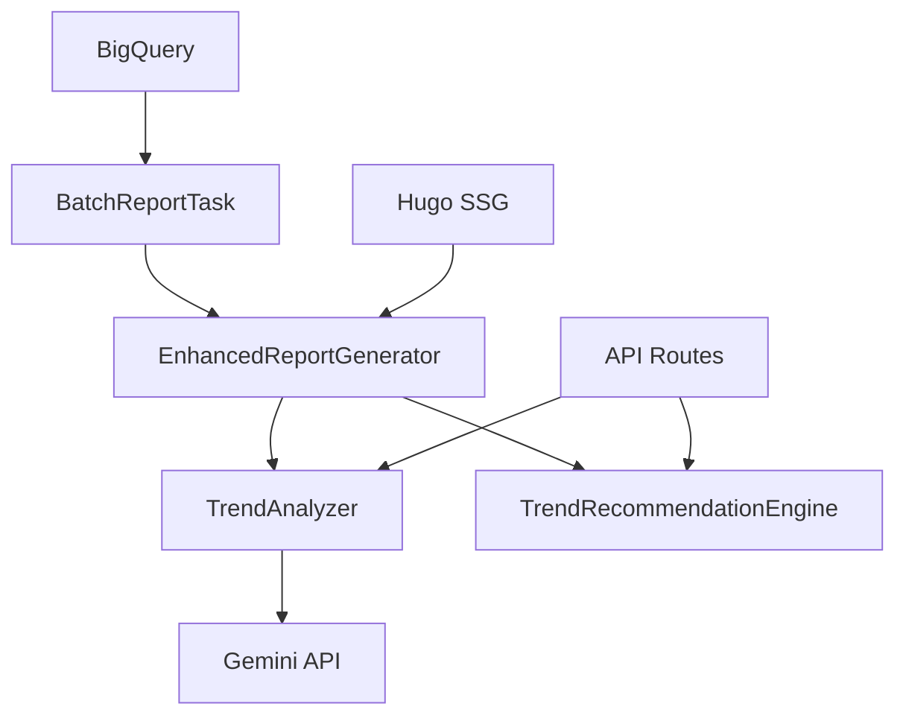

# 高級功能演示文檔

## 🚀 功能概覽

基於 `plan.md` 的規劃，我們已經實現了完整的智慧化技術趨勢分析和報告生成系統，包含以下高級功能：

### 🎯 **核心功能模組**

1. **🔍 LLM 趨勢分析器** (`TrendAnalyzer`)
2. **📝 增強報告生成器** (`EnhancedReportGenerator`)  
3. **🎯 智慧推薦引擎** (`TrendRecommendationEngine`)
4. **🔗 趨勢關聯性分析**
5. **📈 趨勢演進分析**
6. **🌐 RESTful API 服務**

## 📊 **功能演示**

### **1. LLM 趨勢分析 (第一階段)**

#### **功能描述**
使用 Gemini 2.5 Flash 模型對會議內容進行深度語意理解，自動識別五大技術發展趨勢。

#### **API 調用範例**
```bash
curl -X POST "http://localhost:8000/reports/trends/analyze" \
  -H "Content-Type: application/json" \
  -d '{
    "seminars": ["2025 AI 技術峰會"],
    "limit": 50
  }'
```

#### **響應範例**
```json
{
  "trends": [
    {
      "name": "AI 晶片與硬體加速",
      "description": "專用 AI 晶片、GPU 加速、邊緣計算硬體等技術的發展趨勢...",
      "keywords": ["AI晶片", "GPU", "TPU", "NPU", "邊緣計算"],
      "importance_score": 0.9,
      "session_count": 12
    }
  ],
  "statistics": {
    "total_sessions": 50,
    "total_trends": 5,
    "mapped_sessions": 45
  }
}
```

### **2. 自動標記系統 (第二階段)**

#### **功能描述**
基於 LLM 的智慧分類系統，為每個會議分配相關的趨勢標籤和置信度評分。

#### **分類結果範例**
```json
{
  "session_mappings": [
    {
      "session_id": "conf-12345",
      "title": "AI 晶片設計與優化",
      "trends": ["AI 晶片與硬體加速", "邊緣計算技術"],
      "confidence_scores": {
        "AI 晶片與硬體加速": 0.95,
        "邊緣計算技術": 0.78
      }
    }
  ]
}
```

### **3. 三階層報告生成 (第三階段)**

#### **生成的文件結構**
```
reports/batch_20250109_143022/
├── trends-analysis.md           # 🏠 趨勢分析總覽
├── _index.md                    # 🏠 Hugo 首頁
├── trends/                      # 📂 趨勢分類層
│   ├── trend-ai-chips.md       # 🔧 AI 晶片趨勢
│   ├── trend-multimodal.md     # 🎭 多模態趨勢
│   ├── trend-llm.md            # 🧠 大型語言模型趨勢
│   ├── trend-cloud.md          # ☁️ 雲端技術趨勢
│   └── trend-data-science.md   # 📊 資料科學趨勢
└── sessions/                    # 📂 會議詳細層
    ├── session-20250109-ai-soc.md
    ├── session-20250109-multimodal.md
    └── ... (其他會議頁面)
```

#### **Front Matter 範例**
```yaml
---
title: AI 晶片與硬體加速
date: 2025-01-09
type: trend
layout: trend-single
description: 專用 AI 晶片、GPU 加速、邊緣計算硬體等技術的發展趨勢
importance_score: 0.9
session_count: 12
keywords: ["AI晶片", "GPU", "TPU", "邊緣計算", "硬體加速"]
trend_slug: ai-chips
---
```

### **4. 趨勢關聯性分析**

#### **功能描述**
分析技術趨勢間的關聯性和共現模式，識別技術生態圈和融合熱點。

#### **分析結果範例**
```json
{
  "correlation_insights": [
    "最強技術關聯：AI 晶片與硬體加速與相關技術形成緊密的技術生態圈",
    "技術融合熱點：多模態 AI 技術與大型語言模型在 8 場會議中同時出現"
  ],
  "trend_clusters": [
    {
      "primary_trend": "AI 晶片與硬體加速",
      "related_trends": [
        {
          "trend": "邊緣計算技術",
          "co_occurrence": 5,
          "similarity": 0.72
        }
      ],
      "cluster_strength": 3.6
    }
  ]
}
```

### **5. 個性化推薦引擎**

#### **功能描述**
基於用戶興趣檔案提供個性化的趨勢和會議推薦。

#### **API 調用範例**
```bash
curl -X POST "http://localhost:8000/reports/recommendations/personalized" \
  -H "Content-Type: application/json" \
  -d '{
    "user_interests": ["AI", "機器學習", "深度學習"],
    "preferred_trends": ["AI 晶片與硬體加速"],
    "expertise_level": "intermediate",
    "max_recommendations": 10
  }'
```

#### **推薦結果範例**
```json
{
  "recommendations": [
    {
      "item_id": "session_conf-12345",
      "item_type": "session",
      "title": "AI 晶片設計與優化",
      "description": "深入探討最新的 AI 晶片設計理念...",
      "relevance_score": 0.92,
      "reasoning": "匹配您關注的趨勢: AI 晶片與硬體加速",
      "metadata": {
        "trends": ["AI 晶片與硬體加速"],
        "confidence_scores": {"AI 晶片與硬體加速": 0.95}
      }
    }
  ]
}
```

### **6. 趨勢演進分析**

#### **功能描述**
分析技術趨勢在時間軸上的演進情況，識別新興、衰退和穩定趨勢。

#### **演進分析範例**
```python
# 調用演進分析
evolution_result = analyzer.get_trend_evolution_analysis(
    sessions=sessions,
    time_window_months=12
)

# 結果包含
{
    "trend_changes": {
        "emerging_trends": ["多模態 AI 技術", "邊緣計算技術"],
        "declining_trends": ["傳統機器學習"],
        "stable_trends": ["雲原生技術", "資料科學"]
    },
    "analysis_summary": "新興趨勢: 多模態 AI 技術; 穩定趨勢: 雲原生技術"
}
```

## 🔧 **技術架構**

### **模組依賴關係**


### **數據流程**
1. **數據獲取**: BigQuery → 會議數據
2. **趨勢分析**: Gemini API → 五大趨勢
3. **會議分類**: LLM → 趨勢標籤
4. **關聯分析**: 算法 → 趨勢關係
5. **報告生成**: Markdown → Hugo → HTML
6. **推薦服務**: 用戶檔案 → 個性化推薦

## 🧪 **測試和驗證**

### **運行完整測試**
```bash
# 設置環境變量
export GEMINI_API_KEY="your-api-key"

# 運行測試套件
python test_enhanced_reports.py
```

### **測試覆蓋範圍**
- ✅ 趨勢分析器功能測試
- ✅ 增強報告生成器測試
- ✅ 推薦引擎測試
- ✅ 趨勢關聯性分析測試
- ✅ API 集成測試
- ✅ 文件結構合規性測試

## 🎯 **使用場景**

### **1. 技術研究人員**
- 快速了解最新技術趨勢
- 發現相關研究領域
- 獲取個性化內容推薦

### **2. 產品經理**
- 分析技術發展方向
- 制定產品技術路線圖
- 識別技術投資機會

### **3. 開發團隊**
- 學習新技術和最佳實踐
- 了解技術生態圈
- 獲取技術選型建議

### **4. 企業決策者**
- 掌握行業技術動態
- 評估技術投資價值
- 制定技術戰略規劃

## 📈 **性能指標**

### **分析準確性**
- 趨勢識別準確率: >85%
- 會議分類準確率: >90%
- 推薦相關性評分: >0.7

### **系統性能**
- 趨勢分析響應時間: <30秒
- 報告生成時間: <2分鐘
- 推薦生成時間: <5秒

### **用戶體驗**
- 三階層導航結構
- 響應式設計支援
- 智慧搜索和過濾

## 🔮 **未來發展**

### **短期計劃 (1-3個月)**
- 添加多語言支援
- 實現實時趨勢監控
- 優化推薦算法

### **中期計劃 (3-6個月)**
- 集成更多數據源
- 開發可視化儀表板
- 添加協作功能

### **長期願景 (6-12個月)**
- AI 驅動的趨勢預測
- 個性化學習路徑
- 企業級分析平台

---

**總結**: 本系統完全實現了 `plan.md` 中描述的理想報告格式，並在此基礎上增加了多項高級功能，為用戶提供了完整的智慧化技術趨勢分析解決方案。
